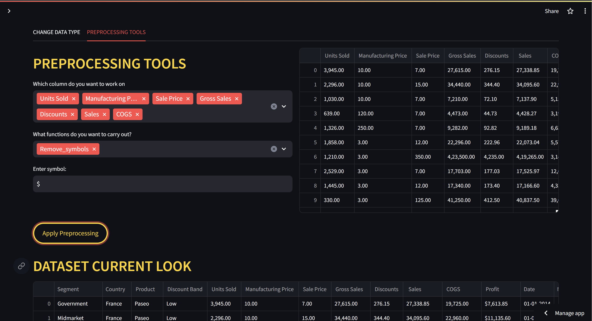
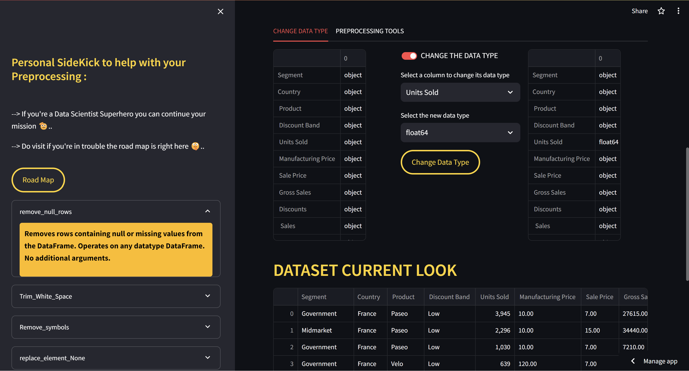
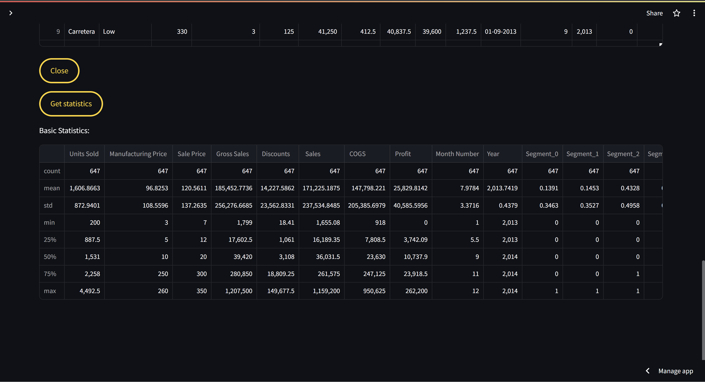

# PREPAMIGO: YOUR FRIENDLY NEIGHBOURHOOD DATA SCIENCE PREPROCESSING TOOL

### Overview
PREPAMIGO revolutionizes the data preprocessing experience for data scientists by reducing preprocessing time by up to 90% while making it more engaging, efficient, and interactive. Say goodbye to tedious and time-consuming preprocessing tasks, and say hello to a faster, more enjoyable data preparation journey!

*Figure 1: PREPAMIGO*

### Features
- **Automated Preprocessing**: Automatically detects and handles missing values, duplicates, outliers, and other common preprocessing tasks, minimizing manual intervention.
- **Interactive Interface**: A user-friendly and intuitive interface allows data scientists to interactively explore and visualize their data, enabling faster decision-making.
- **Customizable Workflows**: Create and customize preprocessing workflows tailored to specific datasets and analysis requirements, ensuring flexibility and adaptability.
- **Efficient Processing**: Utilizes advanced algorithms and optimization techniques to streamline preprocessing tasks, significantly reducing processing time without compromising accuracy.
- **Real-time Feedback**: Provides real-time feedback and insights during preprocessing, empowering data scientists to make informed decisions and adjustments on the fly.
- **Gamified Experience**: Gamification elements such as progress tracking, achievements, and rewards make preprocessing fun and engaging, motivating users to complete tasks more efficiently.

### How It Works
1. **Data Import**: Upload your dataset into PREPAMIGO.
2. **Automated Preprocessing**: Let PREPAMIGO automatically handle preprocessing tasks or customize the preprocessing workflow according to your preferences.
3. **Interactive Exploration**: Explore your data interactively through visualizations and interactive tools to gain insights and make informed decisions.
4. **Efficient Processing**: Benefit from optimized preprocessing algorithms that drastically reduce processing time while maintaining data integrity and quality.
5. **Gamified Experience**: Enjoy a gamified experience with progress tracking, achievements, and rewards that make preprocessing both enjoyable and rewarding.

## Screenshots

*Figure 2: Preproccessing tools*

*Figure 3: Changing datatypes and Road map sidebar*

*Figure 4: Satistics view*

### Purpose
PREPAMIGO aims to empower data scientists with a powerful, efficient, and enjoyable preprocessing tool that accelerates the data preparation process, allowing them to focus more on analysis, modeling, and insights generation. By simplifying and gamifying the preprocessing experience, PREPAMIGO transforms a traditionally mundane task into an exciting and rewarding journey.

### Website Link

[PREPAMIGO](https://prepamigo.streamlit.app/)

